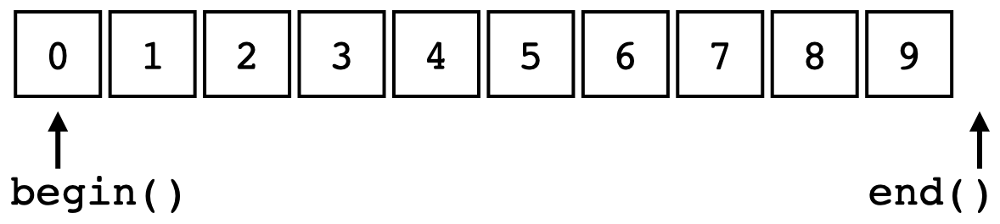
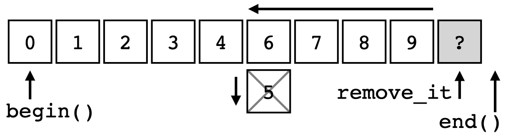
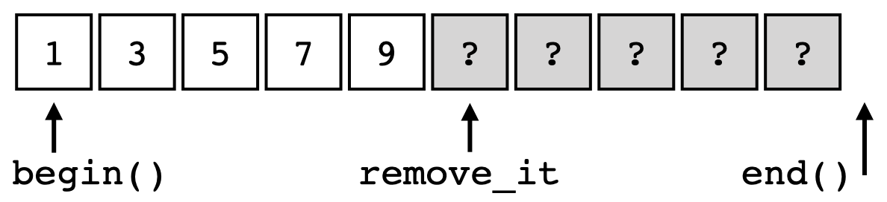
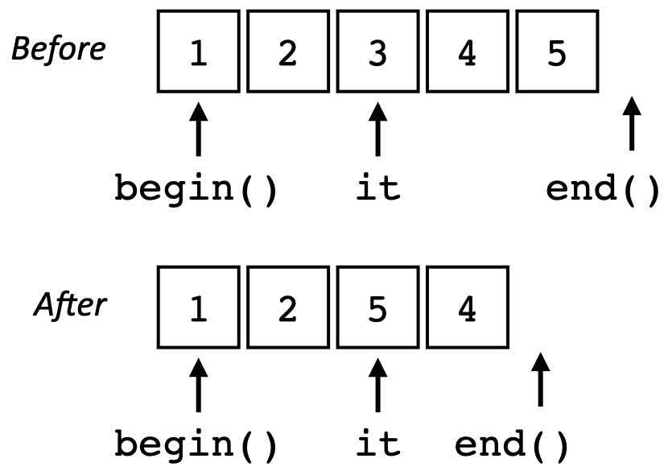
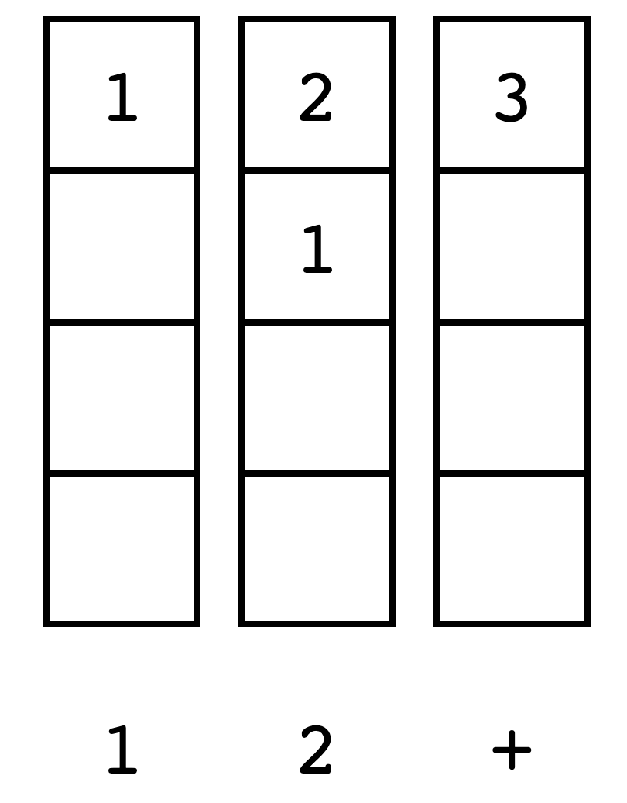
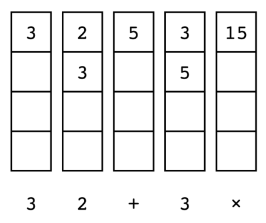
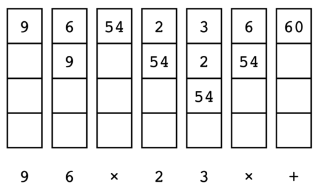

# 第 3 章 STL 容器

本章中，将关注 STL 中的容器类，容器是一个包含其他对象或元素集合的对象。STL 提供了一套完整的容器类型，它们是 STL 的基础。

## 3.1.STL 容器类型的概述

STL 提供了一套全面的容器类型，包括顺序容器、关联容器和容器适配器。以下是简要的概述：

### 顺序容器

顺序容器提供了一个接口，其中元素按顺序排列。虽然可以按顺序使用元素，但其中一些容器是连续存储，而其他容器则不连续存储。STL 包含以下顺序容器：

- `array` 是固定大小的序列，在连续存储器中保存特定数量的元素，分配之后就不能改变大小。这是最简单和访问速度最快的连续存储容器。
- `vector` 就像数组，可以缩小和扩大。其元素是连续存储的，因此改变大小可能涉及分配内存和移动数据的开销。`vector` 可以保留额外的空间来降低操作成本。在 `vector` 容器末端以外的任何位置插入和删除元素将触发元素的重新排列，以保持内存的连续存储。
- `list` 是双链表结构，允许在常量 (`O(1)`) 时间内插入和删除元素。遍历列表的时间为线性 `O(n)`。单链表的变体是 `forward_list`，只能向前迭代。`forward_list` 会使用更少的空间，并且比双链表更高效，但缺少一些功能。
- `deque` （通常发音为 deck）是双端队列，是连续容器，可以在两端展开或收缩。`deque` 允许随机访问它的元素，很像 `vector`，但不保证存储的连续性。

### 关联容器

关联容器将一个键与一个元素关联起来。元素是通过键来引用的，而不是其在容器中的位置。STL 关联容器包括以下容器：

- `set` 是一个关联容器，每个元素也是自己的键，元素通常按某种二叉树方式排序。`set` 中的元素不可变，不能修改，但是可以插入和移除。`set` 中的元素是唯一的，不允许重复。`set` 可以根据排序操作符按顺序进行迭代。
- `multiset` 是键非唯一的集合，允许重复。
- `unordered_set` 是不按顺序迭代的集合。元素不按特定顺序排序，而是根据哈希值进行组织，以便快速访问。
- `unordered_multiset` 类似于 `unordered_set`，允许重复。
- `map` 是键值对的关联容器，其中每个键都映射到特定的值 (或有效负载)。键和值的类型可能不同；键是唯一的，但值不是。`map` 根据其排序操作符，按键的顺序进行迭代。
- `multimap` 类似于具有非唯一键的 `map`，允许重复键。
- `unordered_map` 是不按特定顺序排序的 `map`。
- `unordered_multimap` 类似于 `unordered_map`，允许重复。

### 容器适配器

容器适配器是封装底层容器的类，容器类提供了一组特定的成员函数来访问底层容器元素。STL 提供了以下容器适配器：

- `stack` 提供了后进先出 (LIFO) 接口，该接口中只能从容器的一端添加和提取元素。底层容器可以是 `vector`、`deque` 或 `list` 中的一种。若没有指定底层容器，默认为 `deque`。
- `queue` 提供了先进先出 (FIFO) 接口，其中元素可以在容器的一端添加，并从另一端提取。底层容器可以是 `deque` 或 `list` 容器之一。若没有指定底层容器，默认为 `deque`。
- `priority_queue` 按照严格的弱顺序将最大的值元素保持在顶部，以对数时间插入和提取为代价，提供了对最大值元素的常数时间查找。底层容器可以是 `vector` 或 `deque` 中的一个。若没有指定底层容器，默认为 `vector`。

我们将讨论以下主题：

- 使用擦除函数从容器中删除项
- 常数时间内从未排序的向量中删除项
- 安全地访问 `vector` 元素
- 保持 `vector` 元素的顺序
- 高效地将元素插入到 `map` 中
- 高效地修改 `map` 项的键值
- 自定义键值的 `unordered_map`
- 使用 `set` 对输入进行排序和筛选
- 简单的 `RPN` 计算器与 `deque`
- 使用 `map` 的词频计数器
- 找出含有相应长句的 `vector`
- 使用 `multimap` 制作待办事项列表

## 3.2.相关准备

本章所有的例子和源代码都可以在本书的 GitHub 库中找到，网址是 [chap03](https://github.com/PacktPublishing/CPP-20-STL-Cookbook/tree/main/chap03)。

## 3.3.使用擦除函数从容器中删除项

C++20 前，通常用 erase-remove 从 STL 容器中删除元素。这操作有点麻烦，通常使用这样的函数来完成：

```cpp
template<typename Tc, typename Tv>
void remove_value(Tc & c, const Tv v) {
    auto remove_it = std::remove(c.begin(), c.end(), v);
    c.erase(remove_it, c.end());
}
```

`std::remove()` 函数在 `<algorithms>` 头文件中声明。`remove()` 搜索指定的值，将元素移动到范围的末尾来删除，所以并不会改变容器的大小。它返回一个新范围的尾后迭代器，然后调用容器的 `erase()` 函数删除剩余的元素。

有了新的擦除功能，这个两步过程可以简化为一步：

```cpp
std::erase(c, 5); // same as remove_value() function
```

这个函数与上面的 `remove_value()` 函数功能相同。

还有一个版本使用了谓词函数。例如，要从数值容器中删除所有偶数值：

```cpp
std::erase_if(c, [](auto x) { return x % 2 == 0; });
```

### How to do it

擦除函数有两种形式。第一种形式叫做 `erase()`，有两个参数，一个容器和一个值：

```cpp
erase(container, value);
```

容器可以是顺序容器 (`vector`, `list`, `forward_list`, `deque`)，数组除外，数组不能改变大小。

第二种形式称为 `erase_if()`，接受一个容器和一个谓词函数：

```cpp
erase_if(container, predicate);
```

这种形式适用于使用 `erase()` 的容器，也适用于关联容器、`set`、`map` 及其多键和无序的版本。

函数 `erase()` 和 `erase_if()` 作为**非成员函数**定义在相应容器的头文件中。

来看一些例子：

- 首先，定义一个简单的函数来打印顺序容器的大小和元素：

    ```cpp
    void printc(auto & r) {
        cout << format("size({}) ", r.size());
        for(auto & e : r) cout << format("{} ", e);
        cout << "\n";
    }
    ```

    `printc()` 函数使用 C++20 的 `format()` 函数为 `cout` 格式化字符串。

- 下面是一个包含 10 个整数元素的 `vector`，用 `printc()` 函数打印出来：

    ```cpp
    vector v{ 1, 2, 3, 4, 5, 6, 7, 8, 9 };
    printc(v);
    ```

    输出为：

    ```text
    size: 10: 0 1 2 3 4 5 6 7 8 9
    ```

    可以使用 `erase()` 删除所有值为 5 的元素：

    ```cpp
    erase(v, 5);
    printc(v);
    ```

    输出为：

    ```text
    size: 9: 0 1 2 3 4 6 7 8 9
    ```

    `std::erase()` 函数的 `vector` 版本定义在 `<vector>` 头文件中。在 `erase()` 调用之后，删除值为 5 的元素，`vector` 中有 9 个元素。

- 这也适用于列表容器：

    ```cpp
    list l{0, 1, 2, 3, 4, 5, 6, 7, 8, 9};
    printc(l);
    erase(l, 5);
    printc(l);
    ```

    输出为：

    ```text
    size: 10: 0 1 2 3 4 5 6 7 8 9
    size: 9: 0 1 2 3 4 6 7 8 9
    ```

    `std::erase()` 函数的列表版本定义在 `<list>` 头文件中。`erase()` 之后，删除值为 5 的元素，`list` 有 9 个元素。

- `erase_if()` 可以使用一个简单的谓词函数，删除所有偶数元素：

    ```cpp
    vector v{0, 1, 2, 3, 4, 5, 6, 7, 8, 9};
    printc(v);
    erase_if(v, [](auto x) { return x % 2 == 0; });
    printc(v);
    ```

    输出为：

    ```text
    size: 10: 0 1 2 3 4 5 6 7 8 9
    size: 5: 1 3 5 7 9
    ```

- `erase_if()` 函数也适用于关联容器，比如 `map`:

    ```cpp
    void print_assoc(auto& r) {
        cout << format("size: {}: ", r.size());
        for(auto& [k, v] : r) cout << format("{}:{} ", k, v);
        cout << "\n";
    }

    int main() {
        map<int, string> m{{1, "uno"}, {2, "dos"}, {3, "tres"}, {4, "quatro"}, {5, "cinco"}};
        print_assoc(m);
        erase_if(m, [](auto& p) { auto& [k, v] = p; return k % 2 == 0; } );
        print_assoc(m);
    }
    ```

    输出为：

    ```text
    size: 5: 1:uno 2:dos 3:tres 4:quatro 5:cinco
    size: 3: 1:uno 3:tres 5:cinco
    ```

    因为 `map` 的每个元素都是成对返回的，所以需要不同的函数来打印。`print_assoc()` 函数的作用：在 `for` 循环中使用结构化绑定来解包成对元素。还可以在 `erase_if()` 的谓词函数中使用结构化绑定，来过滤偶数的键值。

### How it works

`erase()` 和 `erase_if()` 函数只是一次性执行 erase-remove 的包装器：

```cpp
template<typename Tc, typename Tv>
void remove_value(Tc & c, const Tv v) {
    auto remove_it = std::remove(c.begin(), c.end(), v);
    c.erase(remove_it, c.end());
}
```

若考虑一个简单的 `int vector`，称为 `vec`，具有以下值：

```cpp
vector vec{0, 1, 2, 3, 4, 5, 6, 7, 8, 9};
```

可以将 `vec` 可视化为一行的 `int` 值表：



`begin()` 迭代器指向第一个元素，`end()` 迭代器指向最后一个元素。此配置是所有 STL 顺序容器的标准。

使用 `remove(c.begin()，c.end()，5)` 时，算法从 `begin()` 迭代器开始搜索匹配的元素。对于找到的每个匹配元素，将下一个元素移到它的位置。然后，继续搜索和移动，直到到达 `end()` 迭代器。结果是一个容器，其中所有没有删除的元素都按照它们原来的顺序在最开始的部分。`end()` 迭代器不变，其余元素未定义。可以这样可视化操作：



`remove()` 函数的作用是：返回一个迭代器 (`remove_it`)，指向移位的元素之后的第一个元素。`end()` 迭代器保持在 `remove()` 操作之前的状态。为了进一步说明，若要使用 `remove_if()` 删除所有偶数元素，结果如下所示：



本例中，剩下的就是 5 个奇数元素，后面跟着 5 个未定义值的元素。

然后，调用容器的 erase() 函数来擦除剩余的元素：

```cpp
c.erase(remove_it, c.end());
```

容器的 `erase()` 函数使用 `remove_it` 和 `end()` 迭代器调用，可以删除所有未定义的元素。

`erase()` 和 `erase_if()` 函数同时调用 `remove()` 函数和容器的 `erase()` 函数，以便一步执行 erase-remove。

## 3.4.常数时间内从未排序的 vector 中删除项

使用擦除函数 (或 erase-remove) 从 `vector` 中间删除项需要 `O(n)` 时间。因为元素必须从 `vector` 的末尾移动，以填补删除项之间的空白。若 `vector` 中项目的顺序不重要，就可以优化这个过程，使其花费 `O(1)`(常数) 时间。

### How to do it

这个方法利用了这样一个事实，即从 `vector` 的末尾删除一个元素是简单快速的。

- 先从定义函数来打印 `vector` 开始：

    ```cpp
    void printc(auto & r) {
        cout << format("size({}) ", r.size());
        for(auto & e : r) cout << format("{} ", e);
        cout << '\n';
    }
    ```

- `main()` 函数中，定义了一个 `int` 类型的 `vector`，并使用 `printc()` 将其打印出来：

    ```cpp
    int main() {
        vector v{0, 1, 2, 3, 4, 5, 6, 7, 8, 9};
        printc(v);
    }
    ```

    输出为：

    ```text
    size(10) 0 1 2 3 4 5 6 7 8 9
    ```

- 现在编写一个函数，从 `vector` 中删除一个元素：

    ```cpp
    template<typename T>
    void quick_delete(T& v, size_t idx) {
        if (idx < v.size()) {
            v[idx] = move(v.back());
            v.pop_back();
        }
    }
    ```

    `quick_delete()` 函数有两个参数，一个 `vector v` 和一个索引 `idx`。首先，检查索引是否在边界之内。然后，从 `<algorithms>` 头文件中调用 `move()` 函数将 `vector` 的最后一个元素移动到索引的位置。最后，调用 `v.pop_back()` 函数从后面缩短 `vector`。

- 还有一个版本的 `quick_delete()`，用于迭代器而非索引。

    ```cpp
    template<typename T>
    void quick_delete(T& v, typename T::iterator it) {
        if (it < v.end()) {
            *it = move(v.back());
            v.pop_back();
        }
    }
    ```

- 现在可以在 `main()` 函数中使用：

    ```cpp
    int main() {
        vector v{12, 196, 47, 38, 19};
        printc(v);
        auto it = std::ranges::find(v, 47);
        quick_delete(v, it);
        printc(v);
        quick_delete(v, 1);
        printc(v);
    }
    ```

    输出如下所示：

    ```text
    size(5) 12 196 47 38 19
    size(4) 12 196 19 38
    size(3) 12 38 19
    ```

    对 `quick_delete()` 的第一次调用使用 `std::ranges::find()` 算法中的迭代器。这将从 `vector` 中删除值 47，`vector(19)` 后面的值取代了它的位置。第二次调用 `quick_delete()` 使用索引 (1) 从 `vector(196)` 中删除第二个元素。同样，`vector` 后面的值会取代其位置。

### How it works

`quick_delete()` 函数使用一个简单的技巧快速有效地从 `vector` 中删除元素。`vector` 后面的元素会移动 (而不是复制) 到要删除的元素的位置。删除的元素在进程中丢弃。

然后，`pop_back()` 函数将 `vector` 从末尾开始缩短一个元素，即删除 `vector` 后面的元素开销很小。`pop_back()` 函数的操作复杂度不变，因为它只更改 `end()` 迭代器。

这个图显示了 `quick_delete()` 操作前后 `vector` 的状态：



`quick_remove()` 操作只是将元素从 `vector` 的后面移动到迭代器 (`it`) 的位置，然后将 `vector` 缩短一个元素。使用 `std::move()` 而不是赋值来移动元素很重要，移动操作比复制赋值快得多，特别是对于大型对象。

若不需要元素有序，那么这种方式就非常有效了。可以在常数 (`O(1)`) 时间内完成，并不涉及到其他元素。

## 3.5.安全地访问 vector 元素

`vector` 是 STL 中使用最广泛的容器之一，并且可以使用 `[]` 操作符来访问 `vector` 中的元素：

```cpp
vector v{19, 71, 47, 192, 4004};
auto & i = v[2];
```

`vector` 类还提供了一个成员函数，与 `[]` 操作符效果相同：

```cpp
auto & i = v.at(2);
```

结果一样，但有一个重要的区别。`at()` 函数执行边界检查，而 `[]` 操作符不检查， `[]` 操作符是为了保持与原始 C 数组的兼容性。

### How to do it

有两种方法访问 `vector` 中带有索引的元素。`at()` 成员函数执行边界检查，而 `[]` 操作符不检查。

- 下面是一个简单的 `main()` 函数，其初始化一个 `vector` 并访问一个元素：

    ```cpp
    int main() {
        vector v{19, 71, 47, 192, 4004};
        auto & i = v[2];
        cout << format("element is {}\n", i);
    }
    ```

    输出为：

    ```text
    element is 47
    ```

    这里，使用 `[]` 操作符直接访问 `vector` 中的第三个元素。与 C++中的大多数顺序对象一样，索引从 0 开始，因此第三个元素是 2。

- 这个 `vector` 有 5 个元素，从 0 到 4。若访问 5 号元素，将超出 `vector` 的边界：

    ```cpp
    vector v{ 19, 71, 47, 192, 4004 };
    auto & i = v[5];
    cout << format("element is {}\n", i);
    ```

    输出为：

    ```text
    element is 0
    ```

    这个结果极具欺骗性。这是一个常见的错误，因为人类倾向于从 1 开始计数，而不是 0。但是不能保证 `vector` 范围外的元素的值。

- 更糟糕的是， `[]` 操作符会无声地允许对超出 `vector` 结尾的位置进行写入：

    ```cpp
    vector v{ 19, 71, 47, 192, 4004 };
    v[5] = 2001;
    auto & i = v[5];
    cout << format("element is {}\n", i);
    ```

    输出为：

    ```text
    element is 2001
    ```

    现在已经写入内存，编译器会默许这样的行为，不会出现任何错误信息或崩溃。但是不要被骗了——这是极其危险的代码，在未来的某个时候会出现问题。越界内存访问是安全漏洞的主要原因之一。

- 解决方案是尽可能使用 `at()` 成员函数，而不是 `[]` 操作符：

    ```cpp
    vector v{19, 71, 47, 192, 4004};
    auto & i = v.at(5);
    cout << format("element is {}\n", i);
    ```

    现在出现了一个运行时异常：

    ```text
    terminate called after throwing an instance of 'std::out_ of_range' what(): vector::_M_range_check: __n (which is 5) >= this->size() (which is 5) Aborted
    ```

    代码编译时没有错误，但是 `at()` 函数检查容器的边界，并尝试访问这些边界之外的内存时，就抛出运行时异常。这是来自 GCC 编译器编译的代码的异常消息，在不同的环境中，信息也会不同。

### How it works

`[]` 操作符和 `at()` 成员函数做同样的工作，可根据容器元素的索引位置直接访问容器元素。 `[]` 操作符不进行边界检查，因此在一些频繁迭代的应用程序中，会快一点。

不过，`at()` 函数应该是首选。虽然边界检查可能需要几个 CPU 周期，但这是一种成本很低的保险。对于大多数应用来说，这样做物有所值。

`vector` 类通常用作直接访问容器，而 `array` 和 `deque` 容器也同时支持 `[]` 操作符和 `at()` 成员函数。

### There's more

某些应用程序中，可能不希望应用程序在遇到出界条件时崩溃。这种情况下，可以捕获异常：

```cpp
int main() {
    vector v{19, 71, 47, 192, 4004};
    try {
        v.at(5) = 2001;
    } catch (const std::out_of_range & e) {
        std::cout <<
        format("Ouch!\n{}\n", e.what());
    }
    cout << format("end element is {}\n", v.back());
}
```

输出为：

```text
Ouch! vector::_M_range_check: __n (which is 5) >= this->size() (which is 5) end element is 4004
```

`try` 块捕获 `catch` 子句中指定的异常，当前的异常是 `std::out_of_range`。`e.what()` 函数返回一个 C 字符串，其中包含来自 STL 库的错误消息。当然，每个库都会有不同的消息，这也适用于 `array` 和 `deque` 容器。

## 3.6.保持 vector 元素的顺序

`vector` 是一个顺序容器，会按照插入元素的顺序保存元素。并不对元素进行排序，也不以任何方式改变其顺序。其他容器，如 `set` 和 `map`，会将元素排序，但这些容器不可随机访问。不过，只需要稍加处理，`vector` 也可以保持有序。

### How to do it

这个示例是创建一个简单的函数 `insert_sorted()`，将一个元素插入到 `vector` 中的正确位置，以保持 `vector` 元素的顺序。

- 先从 `string vector` 类型的别名开始：

    ```cpp
    using Vstr = std::vector<std::string>;
    ```

    这里我喜欢使用类型别名，因为 `vector` 的确切细节并不重要。

- 然后，可以定义几个辅助函数：

    ```cpp
    // print a vector
    void printv(const auto& v) {
        for(const auto& e : v) {
            cout << format("{} ", e);
        }
        cout << "\n";
    }

    // is it sorted?
    void psorted(const Vstr& v) {
        if(std::ranges::is_sorted(v)) cout<< "sorted: ";
        else cout << "unsorted: ";
        printv(v);
    }
    ```

    `printv()` 函数非常简单，其将 `vector` 的元素打印在一行上。

    `psorted()` 函数使用 `is_sorted()` 算法的范围版本，确定 `vector` 是否已排序。然后，使用 `printv()` 来输出 `vector`。

- 可以在 `main()` 函数中初始化一个 `Vstr vector`:

    ```cpp
    int main() {
        Vstr v{
            "Miles",
            "Hendrix",
            "Beatles",
            "Zappa",
            "Shostakovich"};
        psorted(v);
    }
    ```

    输出为：

    ```text
    unsorted: Miles Hendrix Beatles Zappa Shostakovich
    ```

    这里，我们有一个 Vstr vector 与一些有趣的音乐家的名字，但并没有进行排序。

- 使用 `sort()` 算法的范围版本对 `vector` 排序。

    ```cpp
    std::ranges::sort(v);
    psorted(v);
    ```

    输出为：

    ```text
    sorted: Beatles Hendrix Miles Shostakovich Zappa
    ```

- 我们希望能够将相应项插入到 `vector` 中，以便进行排序。`insert_sorted()` 函数做了以下工作：

    ```cpp
    void insert_sorted(Vstr& v, const string& s) {
        const auto pos{ std::ranges::lower_bound(v, s) };
        v.insert(pos, s);
    }
    ```

    `insert_sorted()` 函数使用 `lower_bound()` 算法的范围版本来获取 `insert()` 函数的迭代器，该迭代器保持 vector 的排序。

- 可以使用 `insert_sorted()` 函数，将更多的音乐家名字插入到 `vector` 中：

    ```cpp
    insert_sorted(v, "Ella");
    insert_sorted(v, "Stones");
    ```

    输出为：

    ```text
    sorted: Beatles Ella Hendrix Miles Shostakovich Stones Zappa
    ```

### How it works

`insert_sorted()` 函数用于将元素插入到已排序的 `vector` 中，同时保持其顺序：

```cpp
void insert_sorted(Vstr& v, const string& s) {
    const auto pos{ std::ranges::lower_bound(v, s) };
    v.insert(pos, s);
}
```

`lower_bound()` 算法查找不小于实参的第一个元素。然后，使用 `lower_bound()` 返回的迭代器在正确的位置插入一个元素。

本例中，使用了 `lower_bound()` 的范围版本，其他版本也是可以使用的。

### There's more

`insert_sorted()` 函数可以通过模板变得更加通用。此版本将用于其他容器类型，如 `set`、`deque` 和 `list`。

```cpp
template<typename C, typename E>
void insert_sorted(C& c, const E& e) {
    const auto pos{ std::ranges::lower_bound(c, e) };
    c.insert(pos, e);
}
```

`std::sort()` 算法 (及其衍生算法) 需要支持随机访问的容器，并不是所有的 STL 容器都满足这个要求。值得注意的是，`std::list` 不支持随机访问。

## 3.7.高效地将元素插入到 map 中

`map` 类是保存键值对的关联容器，其中键在容器内必须唯一。

填充 `map` 容器的方法有很多种，可以这样定义 `map`:

```cpp
map<string, string> m;
```

使用 `[]` 操作符添加一个元素：

```cpp
m["Miles"] = "Trumpet";
```

使用 `insert()` 成员函数：

```cpp
m.insert(pair<string,string>("Hendrix", "Guitar"));
```

或者，使用 `emplace()` 成员函数：

```cpp
m.emplace("Krupa", "Drums");
```

我倾向于使用 `emplace()` 函数，可以完全转发来为容器放置 (在适当的位置创建) 新元素。参数直接转发给元素构造函数，快速、高效且易于阅读。

尽管 `emplace()` 肯定是对其他选项的改进，但其问题在于，即使在不需要对象时，也会构造对象。这包括调用构造函数、分配内存、移动数据，然后丢弃临时对象。

为了解决这个问题，C++17 提供了新的 `try_emplace()` 函数，该函数只在需要时构造值对象，这对于大型对象尤为重要。

**Note**
`map` 的每个元素都是一个键值对，键值对中元素名为 `first` 和 `second`，在 `map` 中是键和值。我倾向于将值对象视为有效负载。要搜索一个现有的键，`try_emplace()` 函数必须构造键对象，但不需要构造有效负载对象，除非需要插入到 `map` 中。

### How to do it

新的 `try_emplace()` 函数避免了构造有效负载对象的开销，这在键值碰撞的情况下效率很高，特是在大有效载荷的情况下。

- 首先，创建一个有效负载类。出于演示目的，该类有一个简单的 `std::string` 有效负载，并在构造时显示一条消息：

    ```cpp
    struct BigThing {
        string v_;
        BigThing(const char * v) : v_(v) {
            cout << format("BigThing constructed {}\n", v_);
        }
    };
    using Mymap = map<string, BigThing>;
    ```

    这个 `BigThing` 类只有一个成员函数——构造函数，在构造对象时显示一条消息。我们将使用它来跟踪 `BigThing` 对象的构造频率。实际中，这个类会更大，使用更多的资源。

    `map` 元素由 `pair` 对象组成，一个 `std::string` 用于键，一个 `BigThing` 对象用于负载。这里，`Mymap` 只是一个别名，只是为了让我们能够更专注于功能。

- 再创建一个 `printm()` 函数来打印 `map` 的内容：

    ```cpp
    void printm(Mymap& m) {
        for(auto& [k, v] : m) {
            cout << format("[{}:{}] ", k, v.v_);
        }
        cout << "\n";
    }
    ```

    使用 C++20 的 `format()` 函数打印 `map`，就可以在插入元素时观察它们了。

- `main()` 函数中，创建了 `map` 对象并插入了一些元素：

    ```cpp
    int main() {
        Mymap m;
        m.emplace("Miles", "Trumpet");
        m.emplace("Hendrix", "Guitar");
        m.emplace("Krupa", "Drums");
        m.emplace("Zappa", "Guitar");
        m.emplace("Liszt", "Piano");
        printm(m);
    }
    ```

    输出为：

    ```text
    BigThing constructed Trumpet
    BigThing constructed Guitar
    BigThing constructed Drums
    BigThing constructed Guitar
    BigThing constructed Piano
    [Hendrix:Guitar] [Krupa:Drums] [Liszt:Piano] [Miles:Trumpet] [Zappa:Guitar]
    ```

    输出显示了每个有效负载对象的构造，然后是 `printm()` 函数的输出。

- 使用 `emplace()` 函数将元素添加到 `map` 中，每个有效负载元素只构造一次。这里，也可以使用 `try_emplace()` 函数，结果相同：

    ```cpp
    Mymap m;
    m.try_emplace("Miles", "Trumpet");
    m.try_emplace("Hendrix", "Guitar");
    m.try_emplace("Krupa", "Drums");
    m.try_emplace("Zappa", "Guitar");
    m.try_emplace("Liszt", "Piano");
    printm(m);
    ```

    输出为：

    ```text
    BigThing constructed Trumpet
    BigThing constructed Guitar
    BigThing constructed Drums
    BigThing constructed Guitar
    BigThing constructed Piano
    [Hendrix:Guitar] [Krupa:Drums] [Liszt:Piano] [Miles:Trumpet] [Zappa:Guitar]
    ```

- `emplace()` 和 `try_emplace()` 之间的区别表现在尝试插入具有重复键的新元素时：

    ```cpp
    cout << "emplace(Hendrix)\n";
    m.emplace("Hendrix", "Singer");
    cout << "try_emplace(Zappa)\n";
    m.try_emplace("Zappa", "Composer");
    printm(m);
    ```

    输出为：

    ```text
    emplace(Hendrix)
    BigThing constructed Singer
    try_emplace(Zappa)
    [Hendrix:Guitar] [Krupa:Drums] [Liszt:Piano] [Miles:Trumpet] [Zappa:Guitar]
    ```

    `emplace()` 函数尝试添加一个具有重复键的元素 ("Hendrix")。但失败了，但仍然构造了有效负载对象 ("Singer")。`try_emplace()` 函数还尝试添加一个具有重复键的元素 ("Zappa")。也失败了，但没有构造有效负载对象。

这个例子演示了 `emplace()` 和 `try_emplace()` 之间的区别。

### How it works

`try_emplace()` 函数签名与 `emplace()` 函数签名相似，因此对代码的修改应该很容易。下面是 `try_emplace()` 函数签名：

```cpp
pair<iterator, bool> try_emplace( const Key& k, Args&&... args );
```

乍一看，这与 `emplace()` 签名不同：

```cpp
pair<iterator,bool> emplace( Args&&... args );
```

区别在于 `try_emplace()` 为键参数使用了一个单独的形参，这允许在构造时隔离。从函数上讲，若正在使用模板参数推导，则可以使用 `try_emplace()` 替换：

```cpp
m.emplace("Miles", "Trumpet");
m.try_emplace("Miles", "Trumpet");
```

`try_emplace()` 的返回值与 `emplace()` 的返回值相同，是一个表示迭代器和 `bool` 的 `pair`:

```cpp
const char * key{"Zappa"};
const char * payload{"Composer"};
if(auto [it, success] = m.try_emplace(key, payload); !success) {
    cout << "update\n";
    it->second = payload;
}
printm(m);
```

输出为：

```text
update
BigThing constructed Composer
[Hendrix:Guitar] [Krupa:Drums] [Liszt:Piano] [Miles:Trumpet] [Zappa:Composer]
```

这里使用了结构化绑定 (`auto [it, success] =`) 和 `if` 初始化语句来测试返回值，并有条件地更新有效负载。注意，这仍然构造了有效负载对象。

`try_emplace()` 函数也适用于 `unordered_map`:

```cpp
using Mymap = unordered_map<string, BigThing>;
```

`try_emplace()` 优点，只在准备将有效负载对象存储到 `map` 中时构造有效负载对象。实际中，可在运行时节省大量资源，所以应该首选 `try_emplace()`，而非 `emplace()`。

## 3.8.高效地修改 map 中元素的键

`map` 是存储键值对的关联容器，容器是按键排序的。键必须是唯一的，并且是 `const` 限定的，所以不能更改。

例如，若填充一个 `map` 并试图更改键，在编译时会得到一个错误：

```cpp
map<int, string> mymap {{1, "foo"}, {2, "bar"}, {3, "baz"}};
auto it = mymap.begin();
it->first = 47;
```

输出为：

```text
error: assignment of read-only member ...
    5 | it->first = 47;
      | ~~~~~~~~~~^~~~
```

若需要重新排序 `map` 容器，可以通过使用 `extract()` 方法交换键来实现。C++17 中，`extract()` 是 `map` 类及其派生类中的成员函数。

它允许从序列中提取 `map` 元素，而不涉及有效负载。当提取出来时，键就不再是 `const` 限定的，并且可以修改。

### How to do it

本例中，我们将定义一个表示比赛中的选手的 `map`。在比赛过程中的某个时刻，顺序发生了变化，需要修改 `map` 的键值。

- 先从定义 `map` 类型的别名开始：

    ```cpp
    using Racermap = map<unsigned int, string>;
    ```

- 编写一个函数来打印 `map`:

    ```cpp
    void printm(const Racermap &m) {
        cout << "Rank:\n";
        for (const auto& [rank, racer] : m) {
            cout << format("{}:{}\n", rank, racer);
        }
    }
    ```

    可以随时将 `map` 传递给这个函数，以打印出参赛者的当前排名。

- `main()` 函数中，定义了一个具有赛车初始状态的 `map`:

    ```cpp
    int main() {
        Racermap racers {
            {1, "Mario"}, {2, "Luigi"}, {3, "Bowser"},
            {4, "Peach"}, {5, "Donkey Kong Jr"}
        };
        printm(racers);
        node_swap(racers, 3, 5);
        printm(racers);
    }
    ```

    键是 `int` 型，表示赛车的级别，值是赛车手名字的字符串。

    然后，使用 `printm()` 来打印当前排名。`node_swap()` 将交换两个赛车手的键，然后再次输出。

- 在某个时刻，一名选手落后了，而另一名选手则趁机提升了排名。`node_swap()` 函数将交换两个赛车手的排名：

    ```cpp
    template<typename M, typename K>
    bool node_swap(M & m, K k1, K k2) {
        auto node1{ m.extract(k1) };
        auto node2{ m.extract(k2) };
        if(node1.empty() || node2.empty()) {
            return false;
        }
        swap(node1.key(), node2.key());
        m.insert(move(node1));
        m.insert(move(node2));
        return true;
    }
    ```

    这个函数使用 `map.extract()` 方法从 `map` 中提取指定的元素。这些提取出来的元素称为 `node`。

    `node` 是一个从 C++17 出现的新概念，可以在不涉及元素本身的情况下从 `map` 类型结构中提取元素。解除节点链接，返回节点句柄。提取后，节点句柄通过节点的 `key()` 函数提供对键的可写访问。然后，可以交换键并插入到 `map` 中，无需复制或操作有效负载。

- 当我们运行这段代码时，得到了节点交换前后 `map` 的输出：

    ```text
    Rank:
    1:Mario
    2:Luigi
    3:Bowser
    4:Peach
    5:Donkey Kong Jr

    Rank:
    1:Mario
    2:Luigi
    3:Donkey Kong Jr
    4:Peach
    5:Bowser
    ```

这都是通过 `extract()` 方法和新的 `node_handle` 类实现的。让我们仔细了解一下它是如何工作的。

### How it works

该技术使用 `extract()` 函数，该函数返回一个 `node_handle` 对象，`node_handle` 是节点的句柄，由关联元素及其相关结构组成。`extract` 函数在将节点保留在原处的同时将其解除关联，并返回一个 `node_handle` 对象。这样做的效果是从关联容器中删除节点，而不涉及数据本身。`node_handle` 允许访问已解除关联的节点。

`node_handle` 有一个成员函数 `key()`，返回一个对节点键的可写引用。这就可以在键与容器解关联时，对键值进行修改。

### There's more

使用 `extract()` 和 `node_handle` 时，有几个重点：

- 若没有找到键，`extract()` 函数返回一个空节点句柄。可以用 `empty()` 函数测试节点句柄是否为空：

    ```cpp
    auto node{mapthing.extract(key)};
    if(node.empty()) {
        // node handle is empty
    }
    ```

- `extract()` 有两个重载：

    ```cpp
    node_type extract(const key_type& x);
    node_type extract(const_iterator position);
    ```

    我们使用了第一种形式，通过传递键。你也可以使用不需要查找的迭代器形式。

- 不能用字面量的引用，因为像 `extract(1)` 这样的调用会因 Segmentation fault 而程序崩溃。

- 键插入 `map` 时必须保持键值唯一。

    例如，若将一个键更改为 `map` 中已经存在的值：

    ```cpp
    auto node_x{racers.extract(racers.begin())};
    node_x.key() = 5; // 5 is Donkey Kong Jr
    auto status = racers.insert(move(node_x));
    if(!status.inserted) {
        cout << format("insert failed, dup key: {}",
            status.position->second);
        exit(1);
    }
    ```

    插入失败，会得到错误信息：

    ```shell
    insert failed, dup key: Donkey Kong Jr
    ```

    本例中，将 `begin()` 迭代器传递给 `extract()`。然后，为键值分配了一个已经在使用的值 (5, Donkey Kong Jr)。插入会失败， `status.inserted` 为 `false`。`status.position` 是指向已找到的键的迭代器。在 `if()` 中，我使用 `format()` 来打印找到的键值。

## 3.9.自定义键值的 unordered_map

对于有序 `map`，键的类型必须是可排序的，必须至少支持小于比较操作符。假设希望使用不可排序的自定义类型的关联容器。例如，一个向量 (0,1) 既不大于也不小于 (1,0)，只是指向不同的方向。这种情况下，可以使用 `unordered_map` 类型。

### How to do it

对于这个示例，我们将创建一个 `unordered_map` 对象，该对象使用 x/y 坐标作为键。为此，并且需要一些功能支持。

- 首先，将为坐标定义为一个结构体：

    ```cpp
    struct Coord {
        int x{};
        int y{};
    };
    ```

    有两个元素，x 和 y，作为坐标。

- `map` 将使用 `Coord` 结构作为键，并使用 `int` 作为值：

    ```cpp
    using Coordmap = unordered_map<Coord, int>;
    ```

    为了方便使用 `map`，我们使用了 `using` 别名。

- 要使用 `Coord` 结构体作为键，需要几个重载。这些是使用 `unordered_map` 所必需的。首先，定义一个相等比较运算符：

    ```cpp
    bool operator==(const Coord& lhs, const Coord& rhs) {
        return lhs.x == rhs.x && lhs.y == rhs.y;
    }
    ```

    这是一个很简单的函数，用来比较 x 元素和 y 元素。

- 还需要一个特化的 `std::hash` 类，这就可以使用键检索 `map` 元素了：

    ```cpp
    namespace std {
        template<>
        struct hash<Coord> {
            size_t operator()(const Coord& c) const {
                return static_cast<size_t>(c.x) + static_cast<size_t>(c.y);
            }
        };
    }
    ```

    这为 `std::unordered_map` 类使用的默认哈希类提供了特化，必须在 `std` 命名空间中。

- 还需要一个 `print` 函数来打印 `Coordmap` 对象：

    ```cpp
    void print_Coordmap(const Coordmap& m) {
        for (const auto& [key, value] : m) {
            cout << format("{{ ({}, {}): {} }} ", key.x, key.y, value);
        }
        cout << '\n';
    }
    ```

    这使用 C++20 的 `format()` 函数来打印 x/y 键和值。注意使用双大括号{{和}}来打印单个大括号。

- 现在有了所有的辅助函数，就可以编写 `main()` 函数了。

    ```cpp
    int main() {
        Coordmap m{
            {{0, 0}, 1},
            {{0, 1}, 2},
            {{2, 1}, 3},
        };
        print_Coordmap(m);
    }
    ```

    输出为：

    ```text
    { (0, 0): 1 } { (0, 1): 2 } { (2, 1): 3 }
    ```

    此时，已经定义了一个 `Coordmap` 对象，可接受 `Coord` 对象的键，并将它们映射到值。

- 也可以基于 `Coord` 键访问单个成员：

    ```cpp
    Coord k{0, 1};
    cout << format("{{ ({}, {}): {} }}\n", k.x, k.y, m.at(k));
    ```

    输出为：

    ```text
    { (0, 1): 2 }
    ```

    这里，定义了一个名为 `k` 的 `Coord` 对象，并使用 `at()` 函数从 `unordered_map` 中检索值。

### How it works

`unordered_map` 类依赖于哈希类从键中查找元素，通常会这样实例化对象：

```cpp
std::unordered_map<key_type, value_type> my_map;
```

因为没有创建哈希类，所以其使用了默认的哈希类。`unordered_map` 类的完整模板类型定义如下：

```cpp
template<
    class Key,
    class T,
    class Hash = std::hash<Key>,
    class KeyEqual = std::equal_to<Key>,
    class Allocator = std::allocator<std::pair<const Key,T>>
> class unordered_map;
```

该模板为 `Hash`、`KeyEqual` 和 `Allocator` 提供了默认值。在示例中，为默认的 `std::hash` 类提供了特化。

STL 包含 `std::hash` 对大多数标准类型的特化，如 `string`、`int` 等。为了与我们的类一起工作，其需要进行特化。

可以向模板形参传递一个函数：

```cpp
std::unordered_map<coord, value_type, my_hash_type> my_map;
```

但在我看来，特化方式会更通用。

## 3.10.使用 set 对输入进行排序和筛选

`set` 容器是关联容器，其中每个元素都是一个单独的值作为键。`set` 中的元素按序排列，不允许重复。

`set` 比一般容器 (如 `vector` 和 `map`) 的用途更少和更具体。`set` 的一个常见用途是从一组值中筛选重复项。

### How to do it

这个示例中，我们将从标准输入中读取单词，并过滤掉重复的单词。

- 从定义 `istream` 迭代器的别名开始。我们将使用它从命令行获取输入。

    ```cpp
    using input_it = istream_iterator<string>;
    ```

- `main()` 函数中，将为单词定义一个 `set`：

    ```cpp
    int main() {
        set<string> words;
    ```

    `set` 定义为一组字符串元素。

- 定义了用于 `inserter()` 函数的迭代器：

    ```cpp
    input_it it{cin};
    input_it end{};
    ```

    结束迭代器使用其默认构造函数初始化，这称为流结束迭代器。当输入结束时，这个迭代器将等价于 `cin` 迭代器。

- `inserter()` 函数用于将元素插入到 `set` 容器中：

    ```cpp
    copy(it, end, inserter(words, words.end()));
    ```

    使用 `std::copy()` 可以从输入流中复制单词。

- 现在可以打印 `set` 来查看结果：

    ```cpp
    for(const string & w : words) {
        cout << format("{} ", w);
    }
    cout << '\n';
    ```

- 通过将一堆单词作为输入来运行程序：

    ```text
    $ echo "a a a b c this that this foo foo foo" | ./set-words
    a b c foo that this
    ```

该集合消除了重复项，并保留了插入的单词的排序列表。

### How it works

`set` 容器是这示例的核心，其只保存唯一的元素。当插入重复元素时，插入将失败。所以，最终将得到了一个由每个唯一元素组成的有序列表。

但这并不是这个示例唯一有趣的地方。

`istream_iterator` 是一个从流中读取对象的输入迭代器，可以像这样实例化输入迭代器：

```cpp
istream_iterator<string> it{cin};
```

现在有了一个来自 `cin` 流的 `string` 类型的输入迭代器。每次解引用此迭代器时，都会从输入流中返回一个单词。

我们还实例化了另一个 `istream_iterator`:

```cpp
istream_iterator<string> end{};
```

这将调用默认构造函数，提供了一个特殊的流结束迭代器。当输入迭代器到达流的末尾时，等于流的结束迭代器。这对于结束循环很方便，比如 `copy()` 算法创建的循环。

`copy()` 算法接受三个迭代器，要复制的范围的开始和结束，以及一个目标迭代器：

```cpp
copy(it, end, inserter(words, words.end()));
```

`inserter()` 函数的作用是：接受一个容器和插入点的迭代器，并返回容器及其元素的适当类型的 `insert_iterator`。

`copy()` 和 `inserter()` 的组合使得将元素从流复制到 `set` 容器变得更容易。

## 3.11.简单的 RPN 计算器与 deque

RPN（逆波兰表达式）计算器是一种基于堆栈的计算器，使用后缀符号，其中操作符紧跟在操作数之后。通常用于打印计算器，特别是 HP 12C，有史以来最受欢迎的电子计算器。

熟悉了其操作模式后，许多人更喜欢 RPN 计算器 (自从惠普 12C 和 16C 在上世纪 80 年代初首次推出以来，我一直在使用)。例如，使用传统的代数符号，要将 1 和 2 相加，可以输入 1 + 2。使用 RPN，可以输入 1 2 +。操作符跟在操作数后面。

使用代数计算器，需要按下等号键来表示需要一个结果。对于 RPN 计算器，这是不必要的，因为操操作符立即处理，具有双重作用。另一方面，RPN 计算器通常需要按回车键将操作数推入堆栈。

我们可以使用基于堆栈的数据结构轻松实现 RPN 计算器。例如，实现一个具有四个位置堆栈的 RPN 计算器：



每个操作数在输入时压入堆栈。当输入操作符时，操作数弹出，操作，结果压回堆栈。然后，该结果可用于下一个操作。例如，考虑 (3+2)×3 的情况：



RPN 的优点是可以将操作数留在堆栈上以供将来计算，从而减少了对单独内存寄存器的需求。考虑 (9×6)+(2×3) 的情况：



注意，首先执行括号内的操作，然后对中间结果执行最后的操作。这可能一开始看起来比较复杂，习惯后就好了。

现在，使用 `deque` 容器构建一个简单的 RPN 计算器。

### How to do it

对于这个实现，我们将为堆栈使用 `deque` 容器。为什么不使用 `stack` 容器呢？`stack` 类是一个容器适配器，使用另一个容器 (通常是 `deque`) 进行存储。就我们的目标而言，`stack` 与 `deque` 相比并没有什么区别。`deque` 允许我们遍历和显示 `RPN` 堆栈，就像纸带计算器一样。

- 我们将把 RPN 计算器封装在一个类中，封装提供了安全性、可重用性、可扩展性和干净的接口。我们将类命名为 RPN:

    ```cpp
    class RPN {
        deque<double> deq_{};
        constexpr static double zero_{0.0};
        constexpr static double inf_{std::numeric_limits<double>::infinity()};
    ... // public and private members go here
    };
    ```

    `deque` 数据存储名为 `deq_`，位于类的 `private` 区域。这是我们存储 RPN 堆栈的地方。

    `zero_`常量在整个类中都有使用，既作为返回值，也作为比较操作数。常量 `inf_` 用于除零错误。这些常量会声明为 `constexpr static`，因此不会在每个实例中都占用空间。

    命名私有数据成员时，我喜欢在后面加下划线，以提醒我它们是私有的。

- 我们不需要显式构造函数或析构函数，因为 `deque` 类管理自己的资源。所以，公共接口只包含三个功能：

    ```cpp
    public:
        // process an operand/operator
        double op(const string & s) {
            if(is_numeric(s)) {
                double v{stod(s, nullptr)};
                deq_.push_front(v);
                return v;
            }
            else return optor(s);
        }
        // empty the stack
        void clear() {
            deq_.clear();
        }
        // print the stack
        string get_stack_string() const {
            string s{};
            for(auto v : deq_) {
                s += format("{} ", v);
            }
            return s;
        }
    ```

    `double op()` 函数是 RPN 类的主要入口点，接受一个字符串，包含数字或操作符。若是数字，则转换为双精度数并压入堆栈。若是一个操作符，则调用 `optor()` 来执行该操作。这是这个类的主要逻辑。

    `void clear()` 函数只是在 `deque` 上调用 `clear()` 来清空堆栈。

    最后，`string get_stack_string()` 函数以字符串形式返回堆栈的内容。

- `private` 部分中，有为公共接口工作进行支持的工具函数。`pop_get2()` 函数从堆栈中弹出两个操作数，并将它们作为一对返回，这里使用 `this` 作为操作符的操作数：

    ```cpp
    pair<double, double> pop_get2() {
        if(deq_.size() < 2) return {zero_, zero_};
        double v1{deq_.front()};
        deq_.pop_front();
        double v2{deq_.front()};
        deq_.pop_front();
        return {v2, v1};
    }
    ```

- `is_numeric()` 函数的作用是：检查字符串是否完全是数字，也接受小数点字符。

    ```cpp
    bool is_numeric(const string& s) {
        for(const char c : s) {
            if(c != '.' && !std::isdigit(c)) return false;
        }
        return true;
    }
    ```

- `optor()` 函数执行操作符，使用 `map` 容器将操作符映射到到相应的 `lambda` 函数。

    ```cpp
    double optor(const string& op) {
        map<string, double (*)(double, double)> opmap {
            {"+", [](double l, double r) { return l + r; }},
            {"-", [](double l, double r) { return l - r; }},
            {"*", [](double l, double r) { return l * r; }},
            {"/", [](double l, double r) { return l / r; }},
            {"^", [](double l, double r) { return pow(l, r); }},
            {"%", [](double l, double r) { return fmod(l, r); }}
        };
        if(opmap.find(op) == opmap.end()) return zero_;
        auto [l, r] = pop_get2();
        // don’t divide by zero
        if(op == "/" && r == zero_) deq_.push_front(inf_);
        else deq_.push_front(opmap.at(op)(l, r));
        return deq_.front();
    }
    ```

    带有 `lambda` 函数的 `map` 容器可以快速简便地创建跳转表。

    使用 `map` 中的 `find()` 函数来测试是否有一个有效的操作符。

    对除零进行测试之后，取消对 `map` 的引用，并调用操作符。

    操作的结果会压入堆栈并返回。

- 这些都是 RPN 类的函数成员，可以在 `main()` 函数中使用：

    ```cpp
    int main() {
        RPN rpn;

        for(string o{}; cin >> o; ) {
            rpn.op(o);
            auto stack_str{rpn.get_stack_string()};
            cout << format("{}: {}\n", o, stack_str);
        }
    }
    ```

    我们将通过从命令行将字符串输送到程序中来进行测试，使用 `for` 循环从 `cin` 流中获取每个单词，并将其传递给 `rpn.op()`。我喜欢这里的 `for` 循环，因为其容易地包含了 `o` 变量的作用域。然后，在每个命令行项后使用 `get_stack_string()` 函数打印堆栈。

- 可以通过输入这样的表达式来运行程序：

    ```texts
    $ echo "9 6 * 2 3 * +" | ./rpn
    9: 9
    6: 6 9
    *: 54
    2: 2 54
    3: 3 2 54
    *: 6 54
    +: 60
    ```

这看起来代码很多，但实际上很简单。加上注释，RPN 类的代码不到 70 行。完整的 rpn.cpp 源代码在 GitHub 的库中。

### How it works

RPN 类首先确定每个输入块的性质。若是一个数字，则压入堆栈。若是操作符，则从堆栈顶部取出两个操作数，进行操作，并将结果推回堆栈。若是不识别的输入，就忽略它。

`deque` 类是一个双端队列。为了将其用作堆栈，我们选择一端进行 `push` 和 `pop`。

若确定一个输入是数字，可以将其转换为 `double`，并使用 `push_front()` 将它推到 `deque` 的前面。

```cpp
if(is_numeric(s)) {
    double v{stod(s, nullptr)};
    deq_.push_front(v);
    return v;
}
```

当需要使用堆栈中的值时，可以将它们从 `deque` 的前面弹出。使用 `front()` 获取值，然后 `pop_front()` 将其从堆栈中弹出。

```cpp
pair<double, double> pop_get2() {
    if(deq_.size() < 2) return {zero_, zero_};
    double v1{deq_.front()};
    deq_.pop_front();
    double v2{deq_.front()};
    deq_.pop_front();
    return {v2, v1};
}
```

将操作符放入 `map` 中，可使得检查操作符是否有效和执行操作变得更加容易。

```cpp
map<string, double (*)(double, double)> opmap {
    {"+", [](double l, double r){ return l + r; }},
    {"-", [](double l, double r){ return l - r; }},
    {"*", [](double l, double r){ return l * r; }},
    {"/", [](double l, double r){ return l / r; }},
    {"^", [](double l, double r){ return pow(l, r); }},
    {"%", [](double l, double r){ return fmod(l, r); }}
};
```

可以使用 `find()` 函数来测试操作符的有效性：

```cpp
if(opmap.find(op) == opmap.end()) return zero_;
```

可以通过使用 `at()` 函数对 `map` 进行解引用来调用该操作符：

```cpp
opmap.at(op)(l, r)
```

这里调用运算符 `lambda`，并在一条语句中将结果推入 `deque`:

```cpp
deq_.push_front(opmap.at(op)(l, r));
```

### There's more

这个示例中，我们使用 `cin` 流向 RPN 计算器提供操作。使用 STL 容器同样可以做到相同的效果。

```cpp
int main() {
    RPN rpn;
    vector<string> opv{"9", "6", "*", "2", "3", "*", "+"};
    for(auto o : opv) {
        rpn.op(o);
        auto stack_str{rpn.get_stack_string()};
        cout << format("{}: {}\n", o, stack_str);
    }
}
```

输出为：

```text
9: 9
6: 6 9
*: 54
2: 2 54
3: 3 2 54
*: 6 54
+: 60
```

通过将 RPN 计算器放在接口清晰的类中，我们创建了一个可以在许多不同上下文中使用的灵活工具。

## 3.12.使用 map 的词频计数器

`map` 容器是一个关联容器，由按键值对组织的元素组成。键用于查找，并且必须是唯一的。

在这个示例中，我们将利用 `map` 容器的键值唯一来计算文本文件中每个单词的出现次数。

### How to do it

这个任务有几个部分可以分开解决：

1. 要从一个文件中获取文本，使用 `cin` 流。
2. 需要把单词和标点符号，以及其他非单词的内容分开，所以需要使用正则表达式库。
3. 需要计算每个单词的出现频率，为此使用 `map` 容器。
4. 最后，需要对结果进行排序，首先按频率排序，然后按频率内的单词的字母顺序排序，将对 `vector` 容器进行排序。

- 为了方便起见，先从别名开始：

    ```cpp
    namespace ranges = std::ranges;
    namespace regex_constants = std::regex_constants;
    ```

    对于 `std::` 空间中的命名空间，我喜欢使用短别名。在范围 (`ranges`) 命名空间中，会复用现有算法的名称。

- 将正则表达式存储在一个常量中。我不喜欢使全局名称空间混乱，因为这会导致冲突。我倾向于使用基于我名字首字母的命名空间，比如：

    ```cpp
    namespace bw {
        constexpr const char * re{"(\\w+)"};
    }
    ```

    稍后使用 `bw::re` 很容易获取它。

- 在 `main()` 的顶部，定义了数据结构：

    ```cpp
    int main() {
        map<string, int> wordmap{};
        vector<pair<string, int>> wordvec{};
        regex word_re(bw::re);
        size_t total_words{};
    ```

    我们的主 `map` 叫做 `wordmap`。我们有一个名为 `wordvec` 的 `vector`，我们将对其进行排序。最后，是正则表达式类，`word_re`。

- `for` 循环是大部分工作发生的地方，从 `cin` 流中读取文本，应用正则表达式，并将单词存储在 `map` 中：

    ```cpp
    for(string s{}; cin >> s; ) {
        auto words_begin{sregex_iterator(s.begin(), s.end(), word_re)};
        auto words_end{ sregex_iterator() };
        for(auto r_it{words_begin}; r_it != words_end; ++r_it) {
            smatch match{ *r_it };
            auto word_str{match.str()};
            ranges::transform(word_str, word_str.begin(), [](unsigned char c){ return tolower(c); });
            auto [map_it, result] = wordmap.try_emplace(word_str, 0);
            auto & [w, count] = *map_it;
            ++total_words;
            ++count;
        }
    }
    ```

    我喜欢 `for` 循环，因为它可以控制变量 `s` 的作用域。

    首先为正则表达式结果定义迭代器。这使我们能够区分多个单词，即使周围只有标点符号。`for(r_it...)` 循环返回 `cin` 字符串中的单个单词。

    `smatch` 类型是正则表达式字符串匹配类的特化，给出了正则表达式中的下一个单词。

    然后，使用转换算法使单词小写——这样就可以不考虑大小写而计算单词。(例如，"The"和"the"是同一个词。)

    接下来，使用 `try_emplace()` 将单词添加到 `map` 中。若已经有了，就不会替换。

    最后，使用 `++count` 增加 `map` 中单词的计数。

- 现在，`map` 上有了单词和它们的频率计数，目前按字母顺序排列。不过，我们希望按词频降序排列。为此，会将其放在一个 `vector` 中，并对这个 `vector` 进行排序：

    ```cpp
    auto unique_words = wordmap.size();
    wordvec.reserve(unique_words);
    ranges::move(wordmap, back_inserter(wordvec));
    ranges::sort(wordvec, [](const auto& a, const
    auto& b) {
        if(a.second != b.second)
        return (a.second > b.second);
        return (a.first < b.first);
    });
    cout << format("unique word count: {}\n",
        total_words);
    cout << format("unique word count: {}\n",
        unique_words);
    ```

    `Wordvec` 是一个 `vector`，每个元素包含单词和频率计数。

    使用 `ranges::move()` 算法来填充 `vector`，然后使用 `ranges::sort()` 算法对 `vector` 进行排序。注意，谓词 `Lambda` 函数首先按计数排序 (降序)，然后按单词排序 (升序)。

- 最后，打印结果：

    ```cpp
    for(int limit{20}; auto& [w, count] : wordvec) {
            cout << format("{}: {}\n", count, w);
            if(--limit == 0) break;
    }
    ```

    目前，设置了只打印前 20 个条目的限制。读者们可以注释掉 `if(-limit == 0) break;`，从而可以打印整个列表。

- 示例文件中，包含了埃德加·艾伦·坡的《乌鸦》的文本文件，我们可以用它来测试程序：

    ```text
    $ ./word-count < the-raven.txt
    total word count: 1098
    unique word count: 439
    56: the
    38: and
    ……
    ```

这首诗共有 1098 个单词，其中出现了 439 个单词。

### How it works

这个示例的核心是使用一个 `map` 对象来计数重复的单词。

我们使用 `cin` 流从标准输入中读取文本。默认情况下，`cin` 在读入字符串对象时会跳过空格。通过将一个字符串对象放在 `>>` 操作符的右边 (`cin >> s`)，可以得到用空格分隔的文本块。对于许多目的来说，这是足够好的定义，但我们需要语言学上的单词。为此，需要使用正则表达式。

`regex` 类提供了正则表达式语法的选择，它默认为 ECMA 语法。在 ECMA 语法中，正则表达式 `(\w+)` 是 `([A-Za-z0-9_]+)` 的简写。这将选择包含这些字符的单词。

正则表达式本身就是一种语言。要了解更多关于正则表达式的知识，我推荐 Jeffrey Friedl 的《Mastering regular expressions》这本书。

当从正则表达式引擎获取每个单词时，可以使用 `map` 对象的 `try_emplace()` 方法有条件地将单词添加到单词 `map` 中。若单词不在 `map` 中，则将其添加为 0。若单词已经在 `map` 中，则计数不会受到影响。我们在后面的循环中增加计数，所以其内容总是正确的。

在用文件中的所有单词填充 `map` 后，我们使用 `ranges::move()` 算法将其传输到一个 `vector` 中，`move()` 算法使这种传输快速高效。然后，可以使用 `ranges::sort()` 对 `vector` 进行排序。用于排序的谓词 `lambda` 函数包含了对 `pair` 中两项的比较，因此最终得到一个按计数 (降序) 和单词排序的结果。

## 3.13.找出含有相应长句的 vector

对于作者来说，确保使用了不同的句子长度，或者确保句子不太长对相关工作会很有帮助。现在，来构建一个评估文本句子长度的工具。在使用 STL 时，选择适当的容器是关键。若需要一些有序的东西，通常最好使用关联容器，比如 `map` 或 `multimap`。这种情况下，因为需要自定义排序，所以 `vector` 可能更合适。

`vector` 容器通常是 STL 容器中最灵活的。每当另一种容器类型看起来合适，但缺少一个重要功能时，`vector` 通常是有效的解决方案。所以，需要自定义排序时，就很适合使用 `vector` 完成。

这个示例使用了 `vector` 的 `vector`。内部 `vector` 存储句子中的单词，外部 `vector` 存储内部 `vector`，这在保留所有相关数据的同时提供了很大的灵活性。

### How to do it

程序需要读入单词，找到句子的结尾，存储和排序句子，然后打印出结果。

- 先写一个小函数来判断什么时候到达了句尾：

    ```cpp
    bool is_eos(const string_view & str) {
        constexpr const char * end_punct{ ".!?" };
        for(auto c : str) {
            if(strchr(end_punct, c) != nullptr) return
            true;
        }
        return false;
    }
    ```

    `is_eos()` 函数使用 `string_view`，因为它很有效，而且不需要其他东西。然后，使用 `strchr()` 库函数检查单词是否包含句尾标点字符 (".!?")。这是英语中结束句子最有可能的三个字符。

- `main()` 函数中，我们首先定义 `vector` 的 `vector`:

    ```cpp
    vector<vector<string>> vv_sentences{vector<string>{}};
    ```

    这定义了一个名为 `vv_sentence` 的元素 `vector`，类型为 `vector<string>`。`vv_sentence` 对象初始化为第一个句子的空 `vector`。

    这将创建一个包含其他 `vector` 的 `vector`，内部 `vector` 将每个包含一个词的句子。

- 现在可以处理单词流了：

    ```cpp
    for(string s{}; cin >> s; ) {
        vv_sentences.back().emplace_back(s);
        if(is_eos(s)) {
            vv_sentences.emplace_back(vector<string>{});
        }
    }
    ```

    `for` 循环每次从输入流返回一个单词。`vv_sentence` 对象上的 `back()` 方法用于访问单词的当前 `vector`，并且使用 `emplace_back()` 添加当前单词。然后，使用 `is_eos()` 来查看这是否是句子的结尾。所以，可以添加一个空的 `vector` 到 `vv_sentence` 的下一个句子中。

- 我们总是在 `vv_sentence` 的每个句尾字符之后添加一个新的空 `vector`，所以需要在结尾得到一个空句子 `vector`。在这里进行检查，并在必要时将其删除：

    ```cpp
    // delete back if empty
        if(vv_sentences.back().empty())
            vv_sentences.pop_back();
    ```

- 现在可以根据句子的大小对 vv_sentence vector 进行排序：

    ```cpp
    sort(vv_sentences, [](const auto& l,
            const auto& r) {
                return l.size() > r.size();
            });
    ```

    这就是为什么 `vector` 对这个项目如此方便。使用 `ranges::sort()` 算法和一个简单的谓词，会使按大小降序排序非常快速和容易。

- 现在可以打印结果了：

    ```cpp
    constexpr int WLIMIT{10};
        for(auto& v : vv_sentences) {
            size_t size = v.size();
            size_t limit{WLIMIT};
            cout << format("{}: ", size);
            for(auto& s : v) {
                cout << format("{} ", s);
                if(--limit == 0) {
                    if(size > WLIMIT) cout << "...";
                    break;
                }
            }
            cout << '\n';
        }
        cout << '\n';
    }
    ```

    外环和内环分别对应于外 `vector` 和内 `vector`。简单地遍历这些 `vector`，并使用 `format("{}: ", size)` 打印出内部 `vector` 的大小，然后使用 `format("{} ", s)` 打印出每个单词。若不想完整地打印非常长的句子，可以定义了 10 个单词的限制，若有更多，则打印省略号。

- 输出看起来像这样：

    ```text
    $ ./sentences < sentences.txt
    27: It can be useful for a writer to make sure ...
    19: Whenever another container type seems appropriate,
    but is missing one ...
    18: If you need something ordered, it's often best to use
    ...
    ```

### How it works

使用 C 标准库中的 `strchr()` 函数查找标点符号非常简单，所有的 C 及其标准库都包含在 C++语言的定义中，可以在适当的时候使用。

```cpp
bool is_eos(const string_view & str) {
    constexpr const char * end_punct{ ".!?" };
    for(auto c : str) {
        if(strchr(end_punct, c) != nullptr) return true;
    }
    return false;
}
```

若单词中间有标点符号，这个函数将无法正确地分开句子。这可能发生在某些形式的诗歌或格式糟糕的文本文件中。我曾见过用 `std::string` 迭代器和正则表达式来实现这一点，但对于我们来说，快速和简单就够了。

使用 `cin` 逐字读取文本文件：

```cpp
for(string s{}; cin >> s; ) {
    ...
}
```

这避免了一次性将一个大文件读入内存的开销。`vector` 已经很大，包含文件的所有单词，没有必要将整个文本文件也保存在内存中。在文件过大的情况下，有必要找到另一种策略，或使用数据库。

"`vector` 的 `vector`"乍一看可能很复杂，但它并不比用两个独立的 `vector` 复杂。

```cpp
vector<vector<string>> vv_sentences{vector<string>{}};
```

这声明了一个外部 `vector`，内部元素类型为 `vector<string>`。外层 `vector` 命名为 `vv_sentence`。内 `vector` 是匿名的，不需要命名。这里的定义用一个空 `vector<string>` 对象初始化 `vv_sentence` 对象。

当前的内部 `vector`，可以作为 `vv_sentence.back()` 使用：

```cpp
vv_sentences.back().emplace_back(s);
```

当完成一个内部 `vector` 量时，可以简单地创建一个新 `vector`:

```cpp
vv_sentences.emplace_back(vector<string>{});
```

这将创建一个新的匿名 `vector<string>` 对象，并将其放置在 `vv_sentence` 对象的后面。

## 3.14.使用 multimap 制作待办事项列表

有序任务列表 (或待办事项列表) 是一种常见的计算应用程序，是一个与优先级相关的任务列表，按反向数字顺序排序。

读者可能倾向于使用 `priority_queue`，因为它已经按照优先级 (反向数字) 顺序排序了。`priority_queue` 的缺点是没有迭代器，因此若不从队列中推入或弹出项，就很难对其进行操作。

对于本节的示例，我们将为有序列表使用一个 `multimap`。`multimap` 关联容器保持项目的顺序，并且可以使用反向迭代器以适当的排序顺序对其进行访问。

### How to do it

这是一个简短而简单的示例，用于初始化 `multimap` 并以相反的顺序打印。

- 从 `multimap` 的类型别名开始：

    ```cpp
    using todomap = multimap<int, string>;
    ```

    `todomap` 是一个具有 `int` 键和字符串的 `multimap`。

- 这里有一个小函数以倒序输出 `todomap`:

    ```cpp
    void rprint(todomap& todo) {
        for(auto it = todo.rbegin(); it != todo.rend(); ++it) {
            cout << format("{}: {}\n", it->first,
            it->second);
        }
        cout << '\n';
    }
    ```

    可以使用反向迭代器来输出 `todomap`。

- `main()` 函数很简单：

    ```cpp
    int main() {
        todomap todo {
            {1, "wash dishes"},
            {0, "watch teevee"},
            {2, "do homework"},
            {0, "read comics"},
        };
        rprint(todo);
    }
    ```

    我们用任务初始化 `todomap`。任务没有任何特定的顺序，但在键中确实有优先级。`rprint()` 函数可以按优先级顺序打印它们。

- 输出如下所示：

    ```text
    $ ./todo
    2: do homework
    1: wash dishes
    0: read comics
    0: watch teevee
    ```

    待办事项列表会按优先级顺序打印出来。

### How it works

这是一个简短而简单的示例，使用 `multimap` 容器来保存优先级列表中的项。

需要一些说明的仅是 `rprint()` 函数：

```cpp
void rprint(todomap& todo) {
    for(auto it = todo.rbegin(); it != todo.rend(); ++it) {
        cout << format("{}: {}\n", it->first, it->second);
    }
    cout << '\n';
}
```

注意反向迭代器 `rbegin()` 和 `rend()`。不能改变 `multimap` 的排序顺序，但是它提供了反向迭代器。这使得 `multimap` 的行为完全符合我们对优先级列表的要求。
